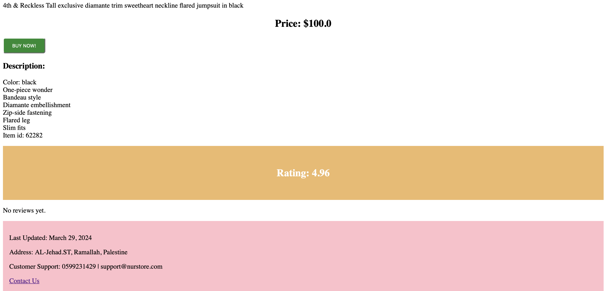
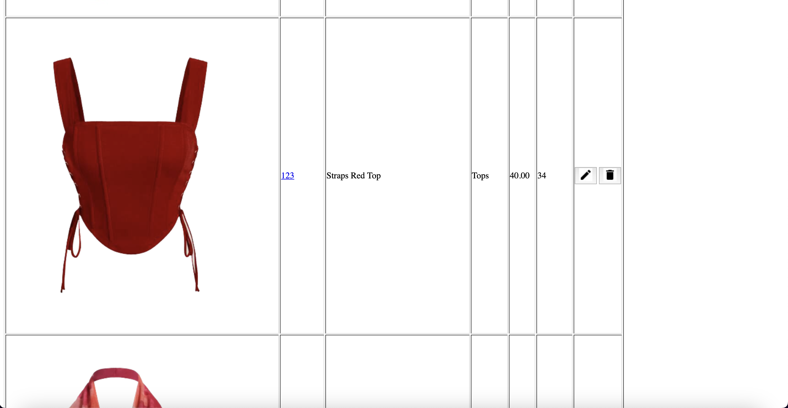
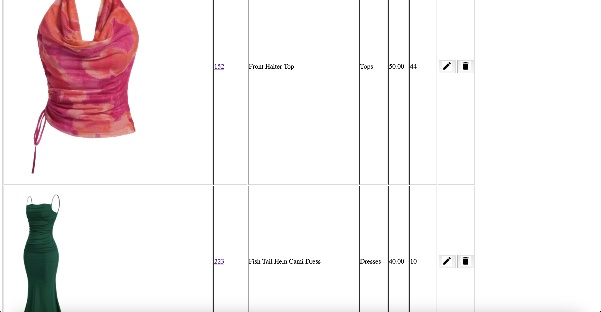
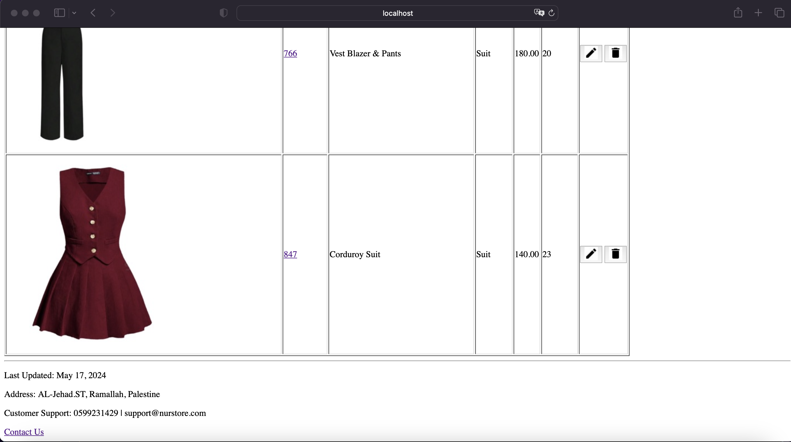
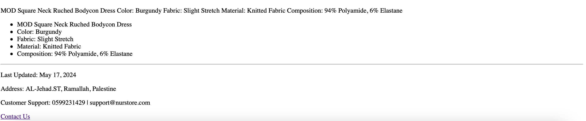

**README - Clothing E-Store Website**

Welcome to the README file for the Clothing E-Store Website project. This document serves as a comprehensive guide to understanding and completing the requirements for the creation of a fictitious clothing e-store. Utilizing the HTML techniques discussed in class and chapters 3 and 5 of the textbook, we aim to develop a visually appealing and functional online platform. Below, you'll find detailed instructions on how to structure my work and insert my content for each section of the project.

### Home Page
- **Objective**: Craft an engaging home page (index.html) within the "ass1" sub-folder. This page should serve as the entry point to the clothing store, effectively conveying its identity, unique selling points, and enticing customers to explore further.

### Registration Page
- **Objective**: Implement a customer registration page to enable users to sign up for an account on the clothing e-store. This page will collect necessary information from users to create their accounts securely.

### Product Pages
- **Objective**: Create two static HTML pages, each dedicated to showcasing a specific clothing product/product. These pages should provide comprehensive information about each product to facilitate informed purchasing decisions.

### Search Page
- **Objective**: allows users to search for products. The user can select which fields to perform the filter search by Product Name, which regenerates the products' table with records matching the search criteria, or by Category or Price. For instance, if the user enters 80 in the search text field, selects price from the radio button, and then clicks the filter button.The search can combine Price and Category, or Name and category, or Name or Price.
  

### Delete Button 
- **Objective**: Delete when clicked a get request with the product ID sent to a script “delete.php”. Which deletes the product Record from the database. Also, as discussed in the View action above, you need to combine the query string with anchor tags.

### View Page
- **Objective**:The Product ID it's hyperlinked, and the anchor element should refer to the “view.php” script, so when clicked, send a GET request. So, combine the query string with anchor tags so the “view.php” script receives as input a query string consisting of the product ID that specifies which product to display. Product details are retrieved from the database. If an invalid ID has been sent, an HMTL page with an error message should be displayed.
  

### add Page
- **Objective**: When the user clicks the add link, the request will be sent to the “add.php” script. The script is a self-reference script, the data is retrieved from the form and then stored in the database. The form's method attribute  set to POST and action to “add.php”. The product photo uploaded to a folder called “images”, only accept an image of type “jpeg”, and rename it to be the same as the prodcut ID. For instance, if you have a product with an ID of ‘112’, the file name should be ‘112.jpeg’. Also, you  save the file name in the database.
  
  
### add Page
- **Objective**:Edit allows the user to update editable product details: price, quantity, description, and product image when clicking a get request with the product ID sent to a script “edit.php.”  The edit script returns an HTML page with a form filled with the product’s details, which are retrieved from the database; the user should be able to change only the editable fields. Then, the user sends the new updated product details to the script “edit.php,” which updates the product's fields in the database. 
  

### Contact Us Page
- **Objective**: Design a Contact Us page to facilitate communication between the store and its customers. This page should offer multiple channels for customers to reach out, ensuring excellent customer support.

